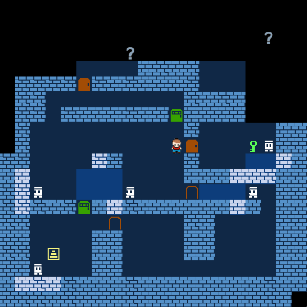

Gold Heist
========================

Avoid patrol bots, steal a gold and come back so as not to be found by enemies!

Features
---------------

  * Stealth and Rogue-like game
  * Gameplay is step-based
  * Single player
  * Arrows to move, SPACE or Z to wait a turn

Installation
---------------

Before install, make sure the all prerequisite are installed.
Required dependences are follows:

  * OpenGL -- An API for rendering 2D and 3D vector graphics
  * GLUT   -- Utilized for using OpenGL in C language
  * glpng  -- A library for OpenGL to load PNG graphics files as an OpenGL texture

To install the application, type:

    make

And you finally get a executable file named "main.exe"

Execution
---------------

To execute this game on Unix, move to the main directory and type:

    ./main.exe

License
---------------

Copyright (c) 2017 @tex2e.

Permission is hereby granted, free of charge, to any person obtaining a copy of
this software and associated documentation files (the "Software"), to deal in
the Software without restriction, including without limitation the rights to
use, copy, modify, merge, publish, distribute, sublicense, and/or sell copies
of the Software, and to permit persons to whom the Software is furnished to do
so, subject to the following conditions:

The above copyright notice and this permission notice shall be included in all
copies or substantial portions of the Software.

THE SOFTWARE IS PROVIDED "AS IS", WITHOUT WARRANTY OF ANY KIND, EXPRESS OR
IMPLIED, INCLUDING BUT NOT LIMITED TO THE WARRANTIES OF MERCHANTABILITY,
FITNESS FOR A PARTICULAR PURPOSE AND NONINFRINGEMENT. IN NO EVENT SHALL THE
AUTHORS OR COPYRIGHT HOLDERS BE LIABLE FOR ANY CLAIM, DAMAGES OR OTHER
LIABILITY, WHETHER IN AN ACTION OF CONTRACT, TORT OR OTHERWISE, ARISING FROM,
OUT OF OR IN CONNECTION WITH THE SOFTWARE OR THE USE OR OTHER DEALINGS IN THE
SOFTWARE.
